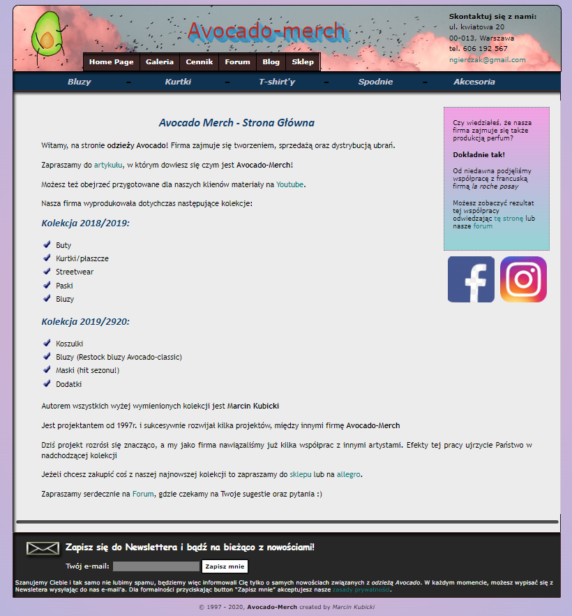

# Avocado-merch - my first website

<h2> Hello viewers! :wave: </h2>

This is my first website project that i created with help of an udemy course available [here](https://www.udemy.com/course/kurs-tworzenia-stron-www-w-html-i-css-od-podstaw-do-eksperta/), made by Arkadiusz Włodarczyk.
I built this expanding on the ideas that were presented during the course.
Website is built using only HTML and CSS, without any JS.

Here is a preview of website:

